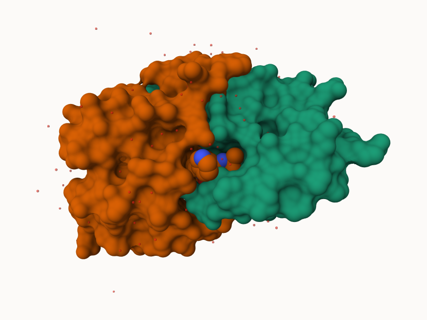
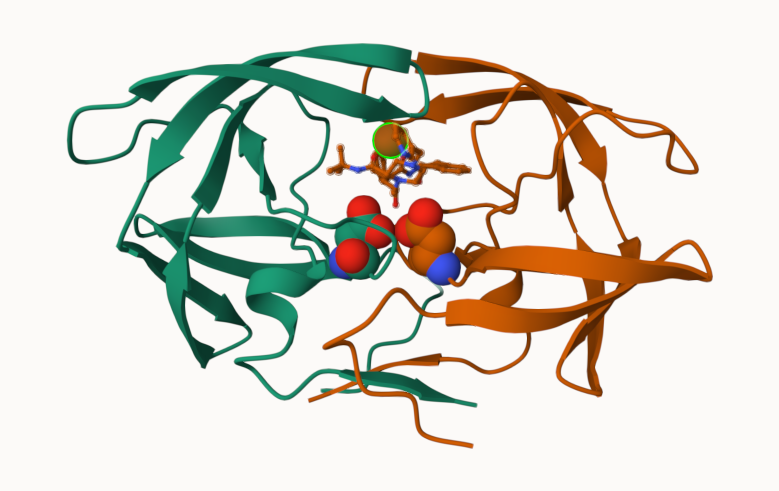
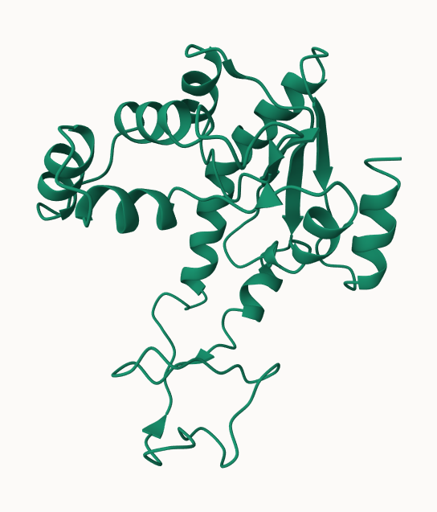
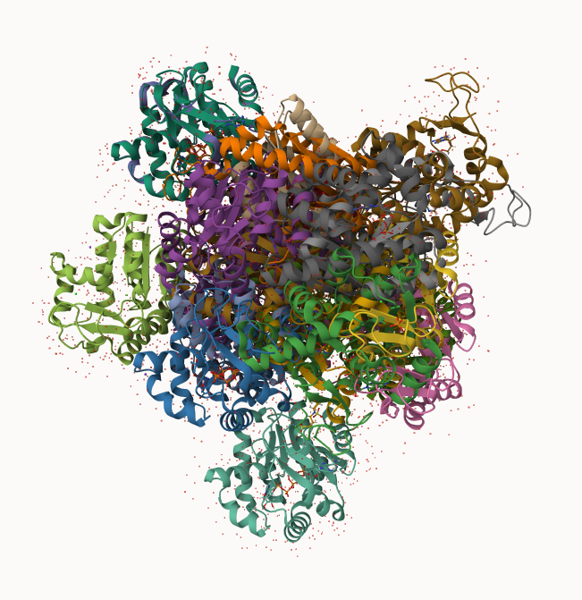

## PDB Statistics

The Protein Data Bank (PDB) is the main repository of biomolecular structures. Lets see what it contains

The commas in these numbers leads to the numbers here being read as character

```{r}
c(100, 10, "barry")
```

```{r}
library(readr)
stats <- read_csv("Data Export Summary.csv")
stats
```

```{r}
sum(stats$`X-ray`)
```

> Q1: What percentage of structures in the PDB are solved by X-Ray and Electron Microscopy.

```{r}
n.xray <- sum(stats$`X-ray`)
#n.em <- 
n.total <- sum(stats$Total)

n.xray/n.total
```

81% of structures are solved by X-Ray and 12.8% of structures are solved by EM(Elctron Microscopy)

> Q2: What proportion of structures in the PDB are protein?

85% 

> Q3: Type HIV in the PDB website search box on the home page and determine how many HIV-1 protease structures are in the current PDB?

4,940 

## Visualizing the HIV-1 protease structure

We can use the Molstar viewer online : https://molstar.org/viewer/ 



A new clean image showing the catalytic ASP25 amino acids in both chains of the HIV-PR dimer along with the inhibitor and all important active site water



## Bio3D package for structural bioinformatics 

```{r}
library(bio3d)

pdb <- read.pdb("1hsg")
pdb
```

```{r}
head(pdb$atom)
```

```{r}
#library(bio3dview)

#view.pdb(pdb)
```

```{r}
# Select the important ASP 25 residue
#sele <- atom.select(pdb, resno=25)

# and highlight them in spacefill representation
#view.pdb(pdb, cols=c("navy","teal"), 
         #highlight = sele,
         #highlight.style = "spacefill") |>
  #setRock()
```


## Predicting functional motions of a single structure

Read an ADK structure from the PDB database:

```{r}
adk <- read.pdb("6s36")
adk
```

```{r}
m <- nma(adk)
plot(m)
```

write out our results as a wee trajectory/movie of predicted motions

```{r}
mktrj(m, file="adk_m7.pdb")
```



## Comparative analysis with PCA 

First step find an ADK sequence:

```{r}
library(bio3d)
id <- "1ake_A" ## Change this to run a different analysis
aa <- get.seq(id)
```

```{r}
aa
```

Next step, is search the PDB database for all related entries:

```{r}
blast <- blast.pdb(aa)
hits <- plot(blast)
```

All the BLAST results are here for us to see:

```{r}
head(blast$hit.tbl)
```

The "top hits" are in the `hits` object. Now we can download these to our computer. Put these in a sub-folder called "pdbs" and use gzip to speed things up

```{r}
# Download releated PDB files
files <- get.pdb(hits$pdb.id, path="pdbs", split=TRUE, gzip=TRUE)
```

These look like a hot mess



Next we will use the `pdbaln()` function to align and also optionally fit (i.e. superpose) the identified PDB structures

This requires a BioCOnductor package called "msa" that we need to install. First we install BiocManager. Then we use `BiocManager::install("msa")`

```{r}
# Align releated PDBs
pdbs <- pdbaln(files, fit = TRUE, exefile="msa")
```

Have a peak at the new "alighment object" `pdbs`

```{r}
pdbs
```

We could view these in R with **bio3dview** `view.pdbs()` function. 

```{r}
library(bio3dview)

view.pdbs(pdbs, colorScheme = "residue")
```

## PCA

We can run PCA on our `pdbs` object using the `pca()` function from **bio3d**:

```{r}
# Perform PCA
pc.xray <- pca(pdbs)
plot(pc.xray)
```

```{r}
plot(pc.xray, 1:2)
```

We can make a visualization of the major conformational difference (i.e. large scale structure change) captured by our PCA analysis with the `mktrj()` function

```{r}
pc1 <- mktrj(pc.xray, file="pca.pdb")
```

Lets see in Molstar

