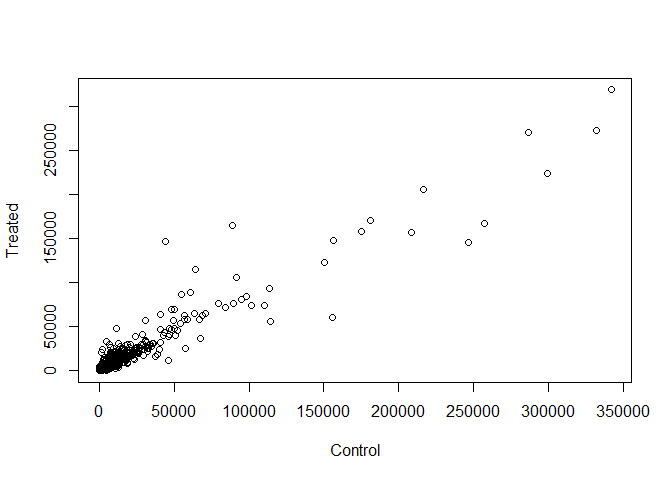
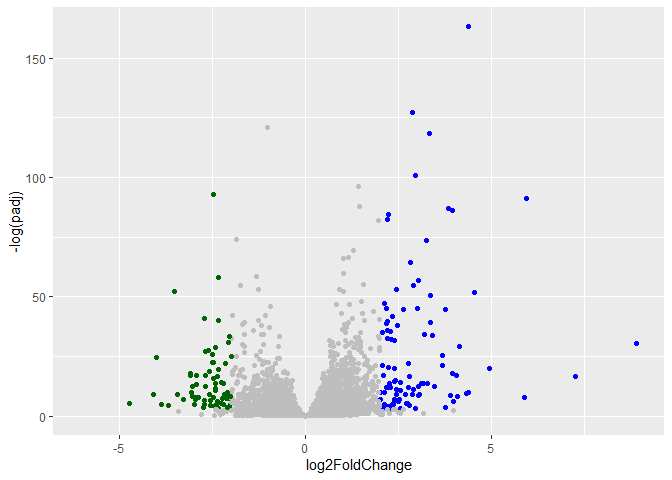

# class13: RNASeq with DESeq2
Ethan Arevalo (A17393064)

- [Background](#background)
- [Data Import](#data-import)
- [Differential gene expression](#differential-gene-expression)
- [DESeq analysis](#deseq-analysis)
  - [Run the DESeq analysis pipeline](#run-the-deseq-analysis-pipeline)
- [Volcano Plot](#volcano-plot)
  - [Adding some color annotation](#adding-some-color-annotation)
- [Save our results](#save-our-results)

## Background

Today we will perform an RNASeq analysis of the effects of a common
steroid on airway cells

In paticular, dexamethasone (herafter just called “dex”) on different
airway smooth muscle cell lines (ASM cells)

## Data Import

We need two different inputs:

- **countData**: with genes in rows and experiments in columns
- **colData**: meta data that describes the columns in countData

``` r
library("DESeq2")
```

    Loading required package: S4Vectors

    Loading required package: stats4

    Loading required package: BiocGenerics

    Loading required package: generics


    Attaching package: 'generics'

    The following objects are masked from 'package:base':

        as.difftime, as.factor, as.ordered, intersect, is.element, setdiff,
        setequal, union


    Attaching package: 'BiocGenerics'

    The following objects are masked from 'package:stats':

        IQR, mad, sd, var, xtabs

    The following objects are masked from 'package:base':

        anyDuplicated, aperm, append, as.data.frame, basename, cbind,
        colnames, dirname, do.call, duplicated, eval, evalq, Filter, Find,
        get, grep, grepl, is.unsorted, lapply, Map, mapply, match, mget,
        order, paste, pmax, pmax.int, pmin, pmin.int, Position, rank,
        rbind, Reduce, rownames, sapply, saveRDS, table, tapply, unique,
        unsplit, which.max, which.min


    Attaching package: 'S4Vectors'

    The following object is masked from 'package:utils':

        findMatches

    The following objects are masked from 'package:base':

        expand.grid, I, unname

    Loading required package: IRanges


    Attaching package: 'IRanges'

    The following object is masked from 'package:grDevices':

        windows

    Loading required package: GenomicRanges

    Loading required package: Seqinfo

    Loading required package: SummarizedExperiment

    Loading required package: MatrixGenerics

    Loading required package: matrixStats


    Attaching package: 'MatrixGenerics'

    The following objects are masked from 'package:matrixStats':

        colAlls, colAnyNAs, colAnys, colAvgsPerRowSet, colCollapse,
        colCounts, colCummaxs, colCummins, colCumprods, colCumsums,
        colDiffs, colIQRDiffs, colIQRs, colLogSumExps, colMadDiffs,
        colMads, colMaxs, colMeans2, colMedians, colMins, colOrderStats,
        colProds, colQuantiles, colRanges, colRanks, colSdDiffs, colSds,
        colSums2, colTabulates, colVarDiffs, colVars, colWeightedMads,
        colWeightedMeans, colWeightedMedians, colWeightedSds,
        colWeightedVars, rowAlls, rowAnyNAs, rowAnys, rowAvgsPerColSet,
        rowCollapse, rowCounts, rowCummaxs, rowCummins, rowCumprods,
        rowCumsums, rowDiffs, rowIQRDiffs, rowIQRs, rowLogSumExps,
        rowMadDiffs, rowMads, rowMaxs, rowMeans2, rowMedians, rowMins,
        rowOrderStats, rowProds, rowQuantiles, rowRanges, rowRanks,
        rowSdDiffs, rowSds, rowSums2, rowTabulates, rowVarDiffs, rowVars,
        rowWeightedMads, rowWeightedMeans, rowWeightedMedians,
        rowWeightedSds, rowWeightedVars

    Loading required package: Biobase

    Welcome to Bioconductor

        Vignettes contain introductory material; view with
        'browseVignettes()'. To cite Bioconductor, see
        'citation("Biobase")', and for packages 'citation("pkgname")'.


    Attaching package: 'Biobase'

    The following object is masked from 'package:MatrixGenerics':

        rowMedians

    The following objects are masked from 'package:matrixStats':

        anyMissing, rowMedians

``` r
counts <- read.csv("airway_scaledcounts.csv", row.names=1)
metadata <- read.csv("airway_metadata.csv")
```

``` r
head(counts)
```

                    SRR1039508 SRR1039509 SRR1039512 SRR1039513 SRR1039516
    ENSG00000000003        723        486        904        445       1170
    ENSG00000000005          0          0          0          0          0
    ENSG00000000419        467        523        616        371        582
    ENSG00000000457        347        258        364        237        318
    ENSG00000000460         96         81         73         66        118
    ENSG00000000938          0          0          1          0          2
                    SRR1039517 SRR1039520 SRR1039521
    ENSG00000000003       1097        806        604
    ENSG00000000005          0          0          0
    ENSG00000000419        781        417        509
    ENSG00000000457        447        330        324
    ENSG00000000460         94        102         74
    ENSG00000000938          0          0          0

``` r
head(metadata)
```

              id     dex celltype     geo_id
    1 SRR1039508 control   N61311 GSM1275862
    2 SRR1039509 treated   N61311 GSM1275863
    3 SRR1039512 control  N052611 GSM1275866
    4 SRR1039513 treated  N052611 GSM1275867
    5 SRR1039516 control  N080611 GSM1275870
    6 SRR1039517 treated  N080611 GSM1275871

> Q1. How many genes are in this dataset

``` r
nrow(counts)
```

    [1] 38694

> Q2. How many control cell lines do we have

``` r
table(metadata$dex)
```


    control treated 
          4       4 

## Differential gene expression

We have 4 replicate drug treated and control (no drug)
columns/experiments in our `counts` object

We want one “mean” value for each gene (rows) in “treated” (drug) and
one mean value for each gene in “control” cols.

> Q3.

Step1. Find all “control” columns

``` r
control.inds <- metadata$dex == "control"
```

Step2. Extract these columns to a new object called `control.counts`

``` r
control.counts <- counts[, control.inds]
```

Step3. Then find the mean value for each gene

``` r
control.mean <- rowMeans(control.counts)
```

> Q4.

Now we do the same thing for the “treated” columns/experiments…

``` r
treated.inds <- metadata$dex == "treated"
```

``` r
treated.counts <- counts[, treated.inds]
```

``` r
treated.mean <- rowMeans(treated.counts)
```

``` r
meancounts <- data.frame(control.mean, treated.mean)
```

> Q5.

A quick plot

``` r
plot(meancounts[,1],meancounts[,2], xlab="Control", ylab="Treated")
```



> Q6.

Lets log transform this count data:

``` r
plot(meancounts, log="xy")
```

    Warning in xy.coords(x, y, xlabel, ylabel, log): 15032 x values <= 0 omitted
    from logarithmic plot

    Warning in xy.coords(x, y, xlabel, ylabel, log): 15281 y values <= 0 omitted
    from logarithmic plot


**N.B.** We most often use log2 for this type of data as it makes the
interpretation much more straightforward

Treated/Control is often called “fold-changed”

If there was no change we would have a log2-fc of 0

``` r
log2(10/10)
```

    [1] 0

If we had double the amount of transcript around

``` r
log2(20/10)
```

    [1] 1

If we have half as much transcript around we would have a log2-fc of -1

``` r
log2(5/10)
```

    [1] -1

``` r
log2(40/10)
```

    [1] 2

> Q. Calculate a log2 fold change value for all our genes and add it as
> a new column to our `meancounts` object.

``` r
meancounts$log2f <- log2(meancounts$treated.mean / 
                          meancounts$control.mean)

head(meancounts)
```

                    control.mean treated.mean       log2f
    ENSG00000000003       900.75       658.00 -0.45303916
    ENSG00000000005         0.00         0.00         NaN
    ENSG00000000419       520.50       546.00  0.06900279
    ENSG00000000457       339.75       316.50 -0.10226805
    ENSG00000000460        97.25        78.75 -0.30441833
    ENSG00000000938         0.75         0.00        -Inf

> Q7. What is the purpose of the arr.ind argument in the which()
> function call above? Why would we then take the first column of the
> output and need to call the unique() function?

arr.ind tells us the zero counts of both genes and samples

There are some “funky” log2fc values (NaN and -Inf) here that came about
when ever we have 0 mean count values. Typically we would remove these
genes from any further analysis - as we can’t say anything about them if
we have no data for them

``` r
zero.vals <- which(meancounts[,1:2]==0, arr.ind=TRUE)

to.rm <- unique(zero.vals[,1])
mycounts <- meancounts[-to.rm,]
head(mycounts)
```

                    control.mean treated.mean       log2f
    ENSG00000000003       900.75       658.00 -0.45303916
    ENSG00000000419       520.50       546.00  0.06900279
    ENSG00000000457       339.75       316.50 -0.10226805
    ENSG00000000460        97.25        78.75 -0.30441833
    ENSG00000000971      5219.00      6687.50  0.35769358
    ENSG00000001036      2327.00      1785.75 -0.38194109

``` r
up.ind <- mycounts$log2fc > 2
down.ind <- mycounts$log2fc < (-2)
```

``` r
up.ind
```

    logical(0)

``` r
down.ind
```

    logical(0)

> Q8. Using the up.ind vector above can you determine how many up
> regulated genes we have at the greater than 2 fc level?

250

> Q9. Using the down.ind vector above can you determine how many down
> regulated genes we have at the greater than 2 fc level?

367

> Q10. Do you trust these results? Why or why not?

No because there is signifier that the values are statisitically
different

## DESeq analysis

Lets do this analysis with an estimate of statistical significance using
the **DESeq2** package

``` r
library(DESeq2)
```

DESeq (like many bioconductor packages) want its input data in a very
specific way.

``` r
dds <- DESeqDataSetFromMatrix(countData = counts,
                       colData = metadata,
                       design = ~dex)
```

    converting counts to integer mode

    Warning in DESeqDataSet(se, design = design, ignoreRank): some variables in
    design formula are characters, converting to factors

### Run the DESeq analysis pipeline

The main function `DESeq()`

``` r
dds <- DESeq(dds)
```

    estimating size factors

    estimating dispersions

    gene-wise dispersion estimates

    mean-dispersion relationship

    final dispersion estimates

    fitting model and testing

``` r
res <- results(dds)
head(res)
```

    log2 fold change (MLE): dex treated vs control 
    Wald test p-value: dex treated vs control 
    DataFrame with 6 rows and 6 columns
                      baseMean log2FoldChange     lfcSE      stat    pvalue
                     <numeric>      <numeric> <numeric> <numeric> <numeric>
    ENSG00000000003 747.194195     -0.3507030  0.168246 -2.084470 0.0371175
    ENSG00000000005   0.000000             NA        NA        NA        NA
    ENSG00000000419 520.134160      0.2061078  0.101059  2.039475 0.0414026
    ENSG00000000457 322.664844      0.0245269  0.145145  0.168982 0.8658106
    ENSG00000000460  87.682625     -0.1471420  0.257007 -0.572521 0.5669691
    ENSG00000000938   0.319167     -1.7322890  3.493601 -0.495846 0.6200029
                         padj
                    <numeric>
    ENSG00000000003  0.163035
    ENSG00000000005        NA
    ENSG00000000419  0.176032
    ENSG00000000457  0.961694
    ENSG00000000460  0.815849
    ENSG00000000938        NA

``` r
36000 * 0.05
```

    [1] 1800

## Volcano Plot

This is a main summary results figure from these kinds of studies. It is
a plot of Log2 fold-change vs (Adjusted) P-value

``` r
plot(res$log2FoldChange,
     res$padj)
```


Again this y-axis highly needs log transforming and we can flip the
y-axis with a minus sign so it looks like every other volcano plot

``` r
plot(res$log2FoldChange,
     -log(res$padj))
abline(v=-2, col="red")
abline(v=+2, col="red")
abline(h=-log(0.05), col="red")
```


### Adding some color annotation

``` r
mycols <- rep("gray", nrow(res))
mycols[res$log2FoldChange > 2] <- "blue"
mycols[res$log2FoldChange < -2] <- "darkgreen"
mycols[res$padj >= 0.05] <- "gray"

plot(res$log2FoldChange,
     -log(res$padj),
     col=mycols)

abline(v=c(-2, +2), lty=2)
abline(h=-log(0.05), lty=2)
```


> Q. Make a presentation quality ggplot version of this plot. Include
> clear axis labels, a clean theme, your custom colors, cut off lines
> and a plot title

``` r
library(ggplot2)

ggplot(res) +
  aes(log2FoldChange,
      -log(padj)) +
  geom_point(col=mycols)
```

    Warning: Removed 23549 rows containing missing values or values outside the scale range
    (`geom_point()`).



``` r
  labs(x="Log2 Fold-change",
     y="-log Adjusted P-value") +
  geom_vline(xintercept = c(-2, 2)) +
  geom_hline(yintercept = -log(0.05)) +
  theme_bw()
```

    NULL

## Save our results

Write a csv file

``` r
write.csv(res, file="results.csv")
```
