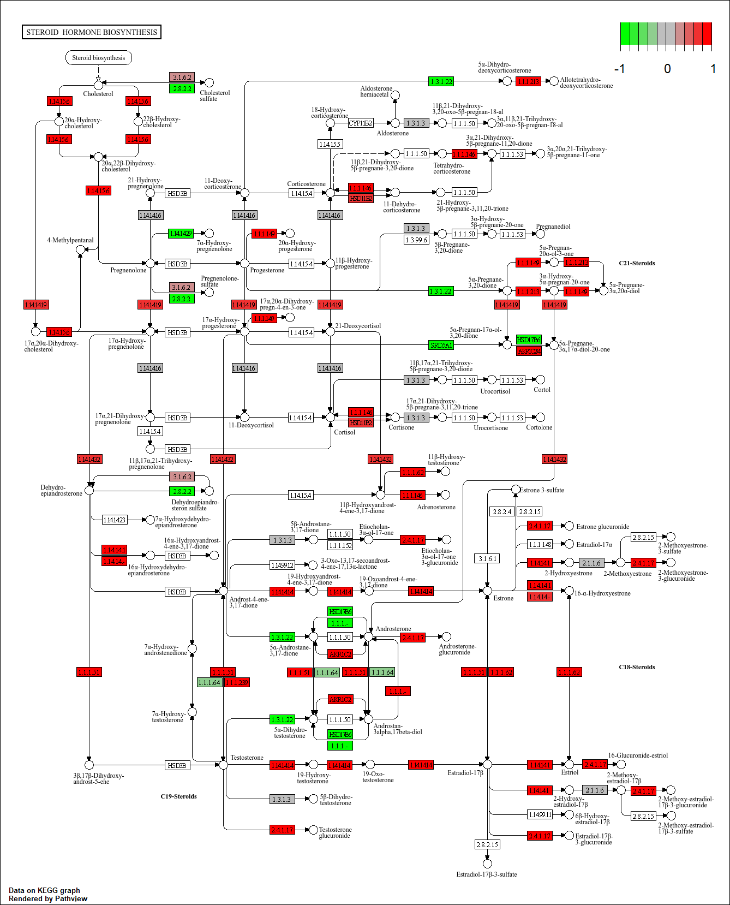
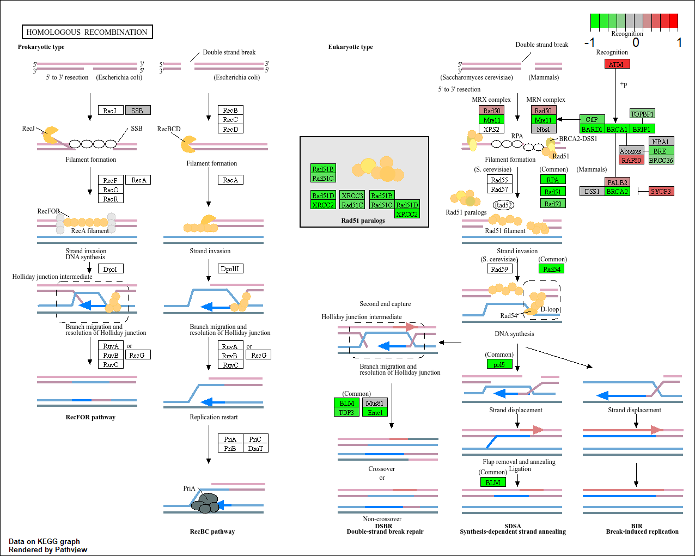

```{r, message=FALSE}
library(DESeq2)
```

```{r}
metaFile <- "GSE37704_metadata.csv"
countFile <- "GSE37704_featurecounts.csv"

# Import metadata and take a peek
colData = read.csv(metaFile, row.names=1)
head(colData)
```

```{r}
# Import countdata
countData = read.csv(countFile, row.names=1)
head(countData)
```

```{r}
countData <- as.matrix(countData[, -1])
head(countData)
```

```{r}
# Filter count data where you have 0 read count across all samples.
countData = countData[rowSums(countData) > 0, ]
head(countData)
```

```{r}
dds = DESeqDataSetFromMatrix(countData = countData,
                             colData = colData,
                             design=~condition)
dds = DESeq(dds)
dds
```

```{r}
res = results(dds)
summary(res)
```

```{r}
write.csv(res, file="results.csv")
```


## Volcano Plot

```{r}
library(ggplot2)

ggplot(res) +
  aes(log2FoldChange,
      -log(padj)) +
  geom_point()
```

```{r}
# Make a color vector for all genes
mycols <- rep("gray", nrow(res))

# Color blue the genes with fold change above 2
mycols[res$log2FoldChange > 2 ] <- "blue"
mycols[res$log2FoldChange < -2 ] <- "blue"
# Color gray those with adjusted p-value more than 0.01
mycols[ res$padj >= 0.05 ] <- "gray"

ggplot(res) +
  aes(log2FoldChange,
      -log(padj)) +
  geom_point(col=mycols) +
  xlab("Log2(FoldChange)") +
  ylab("-Log(P-value)") +
  geom_vline(xintercept = c(-2,2)) +
  geom_hline(yintercept = -log(0.01))
```

## Add Gene Annotation 

```{r}
library("AnnotationDbi")
library("org.Hs.eg.db")

columns(org.Hs.eg.db)

res$symbol = mapIds(org.Hs.eg.db,
                    keys=row.names(res), 
                    keytype="ENSEMBL",
                    column="SYMBOL",
                    multiVals="first")

res$entrez = mapIds(org.Hs.eg.db,
                    keys=row.names(res),
                    keytype="ENSEMBL",
                    column="ENTREZID",
                    multiVals="first")

res$name =   mapIds(org.Hs.eg.db,
                    keys=row.names(res),
                    keytype="ENSEMBL",
                    column="GENENAME",
                    multiVals="first")

head(res, 10)
```

```{r}
write.csv(res, file="results_annotated.csv")
```

# Pathway Analysis

```{r}
library(pathview)
library(gage)
library(gageData)

data(kegg.sets.hs)
data(sigmet.idx.hs)

# Focus on signaling and metabolic pathways only
kegg.sets.hs = kegg.sets.hs[sigmet.idx.hs]

# Examine the first 3 pathways
head(kegg.sets.hs, 3)

```

```{r}
foldchanges = res$log2FoldChange
names(foldchanges) <- res$entrez
head(foldchanges)
```

```{r}
keggres = gage(foldchanges, gsets=kegg.sets.hs)
attributes(keggres)
```

```{r}
head(keggres$less)
```

```{r}
pathview(gene.data=foldchanges, pathway.id="hsa04110")
```


```{r}
pathview(gene.data=foldchanges, pathway.id="hsa03030")
```


```{r}
pathview(gene.data=foldchanges, pathway.id="hsa03013")
```


```{r}
pathview(gene.data=foldchanges, pathway.id="hsa04114")
```


```{r}
pathview(gene.data=foldchanges, pathway.id="hsa03440")
```


## Go Analysis

```{r}
data(go.sets.hs)
data(go.subs.hs)

# Focus on Biological Process subset of GO
gobpsets = go.sets.hs[go.subs.hs$BP]

gobpres = gage(foldchanges, gsets=gobpsets)

lapply(gobpres, head)
```

